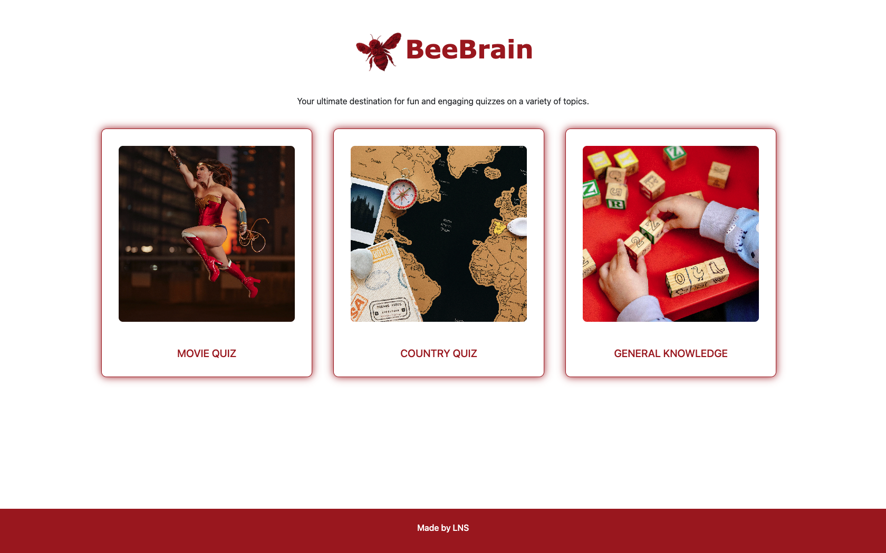
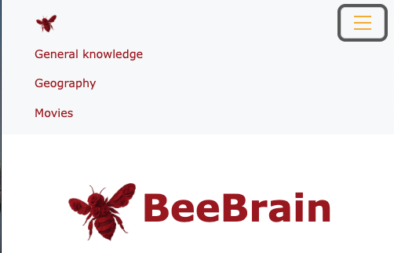
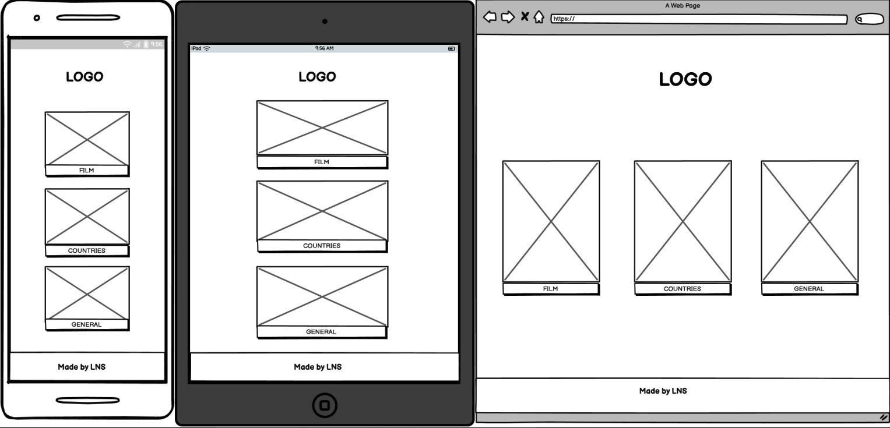
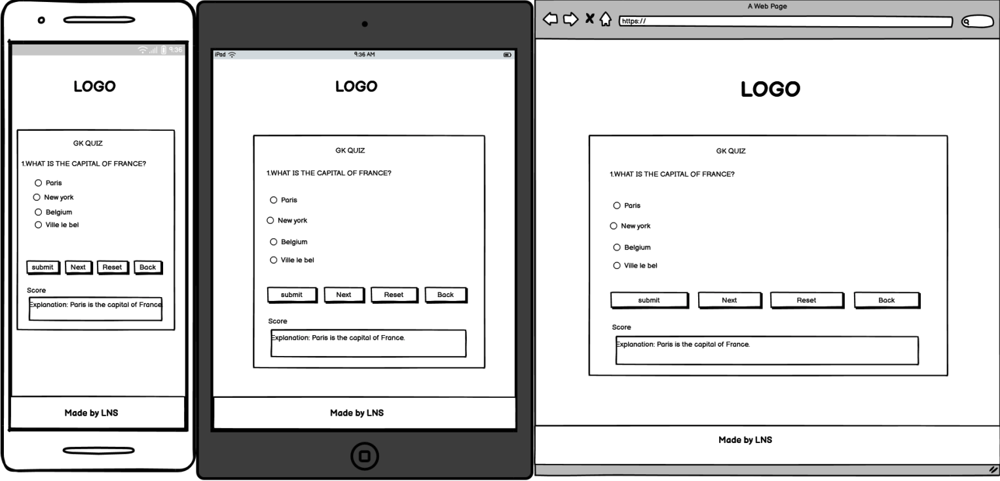

# Bee Brain 

--- 

## Bee Brain - Your ultimate destination for fun and engaging quizzes on a variety of topics.

## [View Bee Brain now on GitHub Pages](https://nanamontford.github.io/bee-brain/)

---

## Table of Contents

- [Introduction](#introduction)
- [User Experience](#user-experience)
- [Features](#features)
- [Wireframe](#wireframe)
- [Deployment](#deployment)
- [AI Augmentation](#ai-augmentation)
- [End Credits](#end-credits)

### Introduction 

**Bee Brain** is a buzzing hub of fun quizzes where users can test their knowledge on everything from movies to geography. Come see if you've got what it takes to ***bee*** the best! 

#### Website Purpose

**Bee Brain's** purpose is to be a place for curious minds to test their knowledge, explore fun quizzes, and ***bee*** entertained with questions from every corner of trivia.

### User Experience

**Bee Brain** has been designed to be simple and easy to use, the site adapts well to different scren sizes thanks to Bootstrap and responsive design principles.

#### User Stories 
- As a teacher, I want to quickly navigate between quizzes so I can use the site seamlessly while working with students.
- As a quiz enthusiast, I want confirmation of my score so I can reflect on my answers and improve.
- As a first-time visitor, I want an inviting welcome page so I can quickly understand the site and decide if it meets my needs.
- As a returning visitor, I want the website to be responsive so I can use it across different screen sizes.

There are further details on the user stories, as well as acceptance criteria, on the [project board](https://github.com/users/nanamontford/projects/4).

#### User Value

This site gives users an enjoyable and interactive experience thathelps them challenge their knowledge, discover new information, and stay entertained - all in one place.

#### Fonts 

Arial in bold was used for headers and Verdana for all other text. These fonts were chosen for readability, particularly for individuals with visual impairments. 

### Features

Below are some key features of **Bee Brain**, along with screenshots that demostrate the functionality and user benefits:

#### Homepage

A clean and inviting homepage that immediately showcases available quizzes, making it easy for users to start playing the engaging and fun quizzes without any hassle.

#### Responsive Navbar

The navigation bar is fully reponsive, adjusting seamlessly to various screen sizes for smooth and accessible browsing on any device.

### Wireframe

**Balsamiq** was used to plan and design this website. The screenshots below show the planning stages for the **Bee Brain** homepage and quiz pages, designed across **desktop, tablet, and mobile sizes** to ensure responsive layouts.

***I found the wireframing process straightforward and user-friendly. It's designed to be quick, which allowed me to focus on layout and user flow rather than visual details. The drag-and-drop interface made it easy to explore different ideas, and the sketch-style visuals helped keep the emphasis on functionality over design polish.***

### Deployment

This site is being deployed using **GitHub Pages**. See link below.

## [View Bee Brain now on GitHub Pages](https://nanamontford.github.io/bee-brain/)

How this site was deployed:

1. Logging in to GitHub
2. Finding this project's repository.
3. Clicking on the Settings link.
4. Clicking on the Pages link - located in the left-hand navigation menu.
5. In the source section, this is where you would select the root from the drop-down menu.
6. Once this was saved, GitHub Pages deployed the site at the respective URL.

### AI Augmentation
<!-- talk about how it was used to assist in debugging errors, logo generation/creation, give suggested corrections with explinations, optimise code for performance & UX/UI, help the learning & development process + workflow -->

### End Credits

Created by **Sameera**, **Nana** and **Liam** 2025