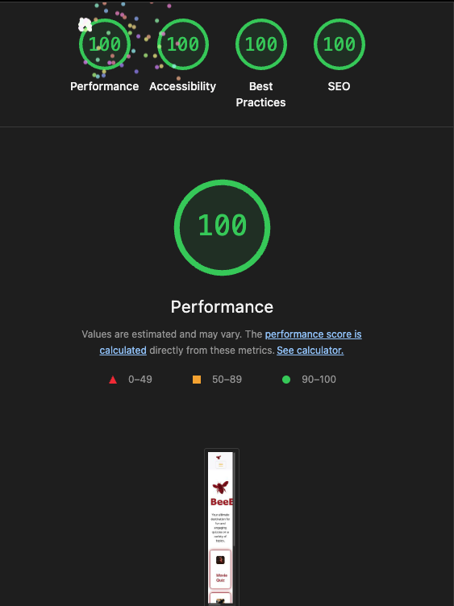
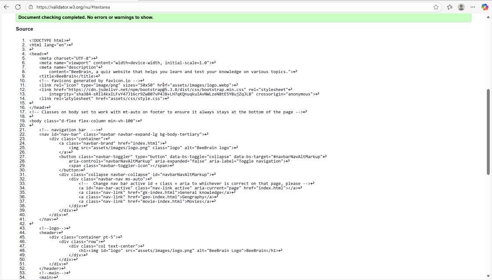
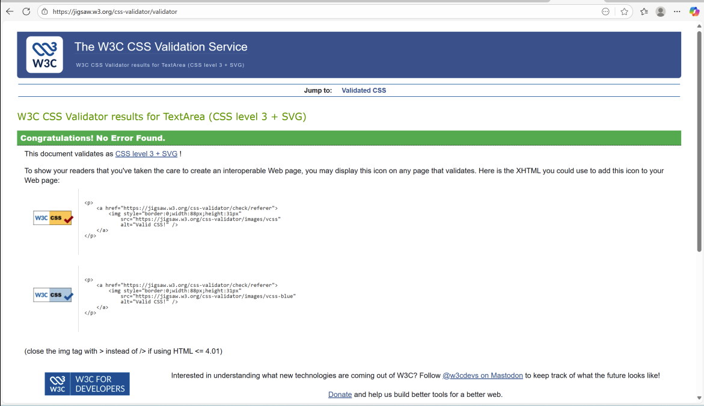
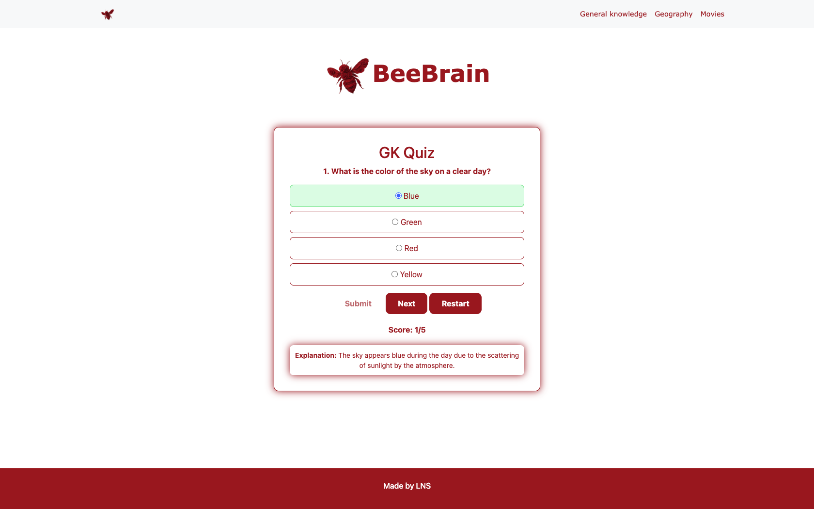

# Bee Brain

---

## Bee Brain - Your ultimate destination for fun and engaging quizzes on a variety of topics.

## [View Bee Brain now on GitHub Pages](https://nanamontford.github.io/bee-brain/)

---

## Table of Contents

- [Introduction](#introduction)
- [User Experience](#user-experience)
- [Features](#features)
- [Tools Used](#tools-used)
- [Wireframe](#wireframe)
- [Deployment](#deployment)
- [AI Augmentation](#ai-augmentation)
- [End Credits](#end-credits)

### Introduction 

**Bee Brain** is a buzzing hub of fun quizzes where users can test their knowledge on everything from movies to geography. Come see if you've got what it takes to ***bee*** the best! 

#### Website Purpose

**Bee Brain's** purpose is to be a place for curious minds to test their knowledge, explore fun quizzes, and ***bee*** entertained with questions from every corner of trivia.

### User Experience

**Bee Brain** has been designed to be simple and easy to use, the site adapts well to different scren sizes thanks to Bootstrap and responsive design principles.

#### Verifications

**100% Lighthouse Performance Score** - ensures fast loading, reliable performance, and adherence to best practices, including SEO.
 

**Fully Passed W3C Validation** - both HTML & CSS passed official W3C validators with no issues, ensuring clean and compliant code.

#### User Stories 
- As a teacher, I want to quickly navigate between quizzes so I can use the site seamlessly while working with students.
- As a quiz enthusiast, I want confirmation of my score so I can reflect on my answers and improve.
- As a first-time visitor, I want an inviting welcome page so I can quickly understand the site and decide if it meets my needs.
- As a returning visitor, I want the website to be responsive so I can use it across different screen sizes.

#### Project Board

There are further details on the user stories, as well as acceptance criteria, on the [project board](https://github.com/users/nanamontford/projects/4).

#### User Value

This site gives users an enjoyable and interactive experience thathelps them challenge their knowledge, discover new information, and stay entertained - all in one place

#### Fonts 

Arial in bold was used for headers and Verdana for all other text. These fonts were chosen for readability, particularly for individuals with visual impairments. 

### Features

Below are some key features of **Bee Brain**, along with screenshots that demostrate the functionality and user benefits:

#### Homepage

A clean and inviting homepage that immediately showcases available quizzes, making it easy for users to start playing the engaging and fun quizzes without any hassle.

#### Responsive Navbar

The navigation bar is fully reponsive, adjusting seamlessly to various screen sizes for smooth and accessible browsing on any device.

The navigation is always visible at the top of the website as it is fixed. The Bee Brain logo is on the left while the links to each quiz (General Knowledge, Geography, Movies) and the homepage are on the right. 

The presentation of the navigation changes in response to screen size. On larger screens, it take up the full width with all of the quiz names visible. On smaller screens, the navigation bar items condenses into a drop-down menu. 

In keeping the user interface themes of the website, when the quiz names is hovered over the text transforms to be x1.02 larger, the text color changes from red to black and a red box shadow highlights the word. The hover effect is disabled on current page to indicate to the user’s current location.

#### Quizzes

Users are presented with a question and four multiple-choice answers. They can select the answer they think is correct and then either **submit** their choice or **reset** the game using the buttons below. This allows users to interactively test their knowledge and restart the quiz at any time.

### Tools Used

- **HTML** - Used for the structure and layout of the website.
- **CSS & Bootstrap** - Handled styling, responsiveness, and design features like media queries, layout grids, and colour theme.
- **JavaScript** - Added interactivity to the quizzes and handled user input and dynamic elements.
- **Copilot, Bing Image Creator, and ChatGPT** - These AI tools were used to streamline efficiency, resolve bugs, tidy up code, and create the website logo.

### Wireframe

**Balsamiq** was used to plan and design this website. The screenshots below show the planning stages for the **Bee Brain** homepage and quiz pages, designed across **desktop, tablet, and mobile sizes** to ensure responsive layouts.

***I found the wireframing process straightforward and user-friendly. It's designed to be quick, which allowed me to focus on layout and user flow rather than visual details. The drag-and-drop interface made it easy to explore different ideas, and the sketch-style visuals helped keep the emphasis on functionality over design polish.***

### Deployment

This site is being deployed using **GitHub Pages**. See link below.

## [View Bee Brain now on GitHub Pages](https://nanamontford.github.io/bee-brain/)

How this site was deployed:

1. Logging in to GitHub
2. Finding this project's repository.
3. Clicking on the Settings link.
4. Clicking on the Pages link - located in the left-hand navigation menu.
5. In the source section, this is where you would select the root from the drop-down menu.
6. Once this was saved, GitHub Pages deployed the site at the respective URL.

### AI Augmentation

AI tools like Copilot were used in this project to help fix grammar, catch bugs, and streamline code cleanup, which helped speed up development and keep things tidy.

Another AI tool, Bing Image Creator, was used to design and create the website logo. This helped speed up the design process and keep the look consistent throughout the website.

ChatGPT was used to guide on best practices, such as writing a clear and concise README and checking that the code was correct. 

AI contributed to performance and UX improvements by recommeding optimisations and simplifying code structures. This made the website more responsive and enhanced overall user interaction while improving development efficiency. 

### End Credits

Created by **Sameera**, **Nana**, and **Liam**. **2025**

#### Acknowledgements

Inspiration taken from previous projects shared with us, including:
- Geography Quiz (https://charlie-lambino-worthington.github.io/hackathon/)
- The Arcadean's Project (https://wen-l-liu.github.io/hackathon-pixels/)
- Interactive Quiz Application (https://bootstrapexamples.com/@ross-wille/interactive-quiz-application)
- Bootstrap Quiz Online Template Example (https://bbbootstrap.com/snippets/bootstrap-mcq-quiz-online-test-template-83992612)